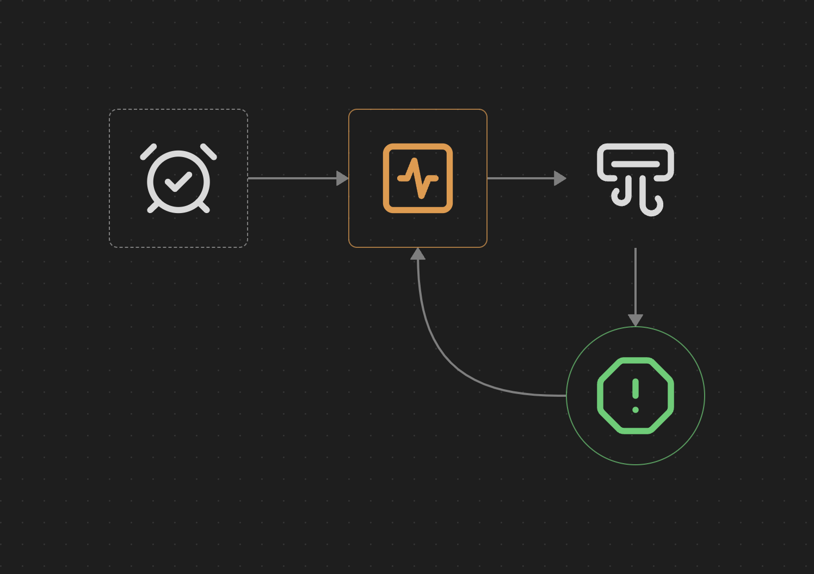
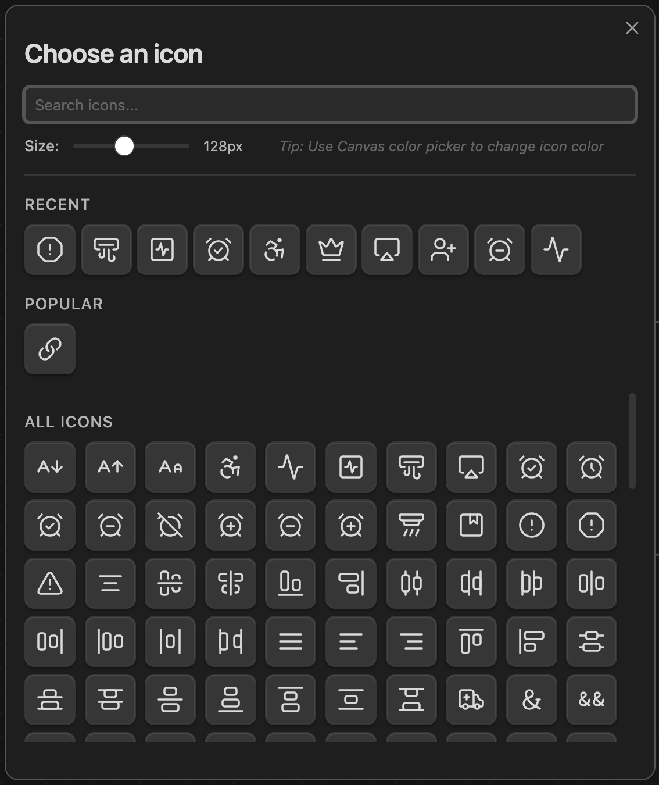

# Canvas Icons

An Obsidian plugin that allows you to add icons directly to your Canvas.



## Features

- **Add icons to Canvas** — Choose from 800+ Lucide icons
- **Toolbar button** — Quick access button in Canvas toolbar
- **Search icons** — Fast icon search by name
- **Canvas colors** — Icons automatically adapt to Canvas node colors
- **Resize icons** — Icons scale with the node size
- **Double-click to edit** — Change icon by double-clicking on it
- **Recent icons** — Quick access to recently used icons
- **Popular icons** — Curated list of commonly used icons

## Installation

### From Obsidian Community Plugins (Recommended)

1. Open Obsidian Settings
2. Go to Community Plugins
3. Search for "Canvas Icons"
4. Click Install, then Enable

### Manual Installation

1. Download `main.js`, `manifest.json`, and `styles.css` from the [latest release](https://github.com/your-username/obsidian-canvas-icons/releases/latest)
2. Create a folder `obsidian-canvas-icons` in your vault's `.obsidian/plugins/` directory
3. Copy the downloaded files into the folder
4. Reload Obsidian and enable the plugin in Settings → Community Plugins

## Usage

### Adding an Icon

1. Open a Canvas file
2. Click the **smile icon** (😊+) in the Canvas toolbar
3. Search or browse for an icon
4. Click on the icon to add it to the canvas



### Changing Icon Color

1. Select the icon node on Canvas
2. Use the standard Canvas color picker (right-click → Set color, or use the color menu)
3. The icon stroke will automatically change to match the selected color

### Editing an Icon

- **Double-click** on an icon to open the icon picker and change it

### Keyboard Shortcut

Use `Ctrl/Cmd + P` and search for "Add icon to Canvas" to add an icon via command palette.

## Settings

| Setting | Description | Default |
|---------|-------------|---------|
| Default icon size | Size of new icons in pixels | 64px |
| Maximum recent icons | Number of recent icons to remember | 20 |

## Development

```bash
# Clone the repository
git clone https://github.com/your-username/obsidian-canvas-icons.git

# Install dependencies
npm install

# Build for development (watch mode)
npm run dev

# Build for production
npm run build
```

## Support

If you find this plugin useful, consider:

- ⭐ Starring the repository on GitHub
- 🐛 Reporting bugs or suggesting features via [Issues](https://github.com/your-username/obsidian-canvas-icons/issues)
- 💡 Contributing to the project

## License

MIT License — see [LICENSE](LICENSE) for details.

## Acknowledgments

- Icons provided by [Lucide](https://lucide.dev/)
- Built for [Obsidian](https://obsidian.md/)

